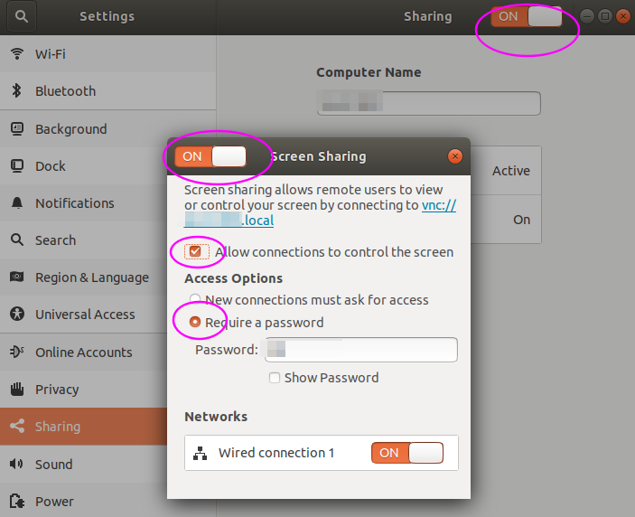

# 场景

机房服务器安装了Ubuntu Desktop，但没外接显示器，而有时我们需要远程至Ubuntu Desktop的GUI桌面。这里梳理出一个方案，主要有以下几点：

- 使用Ubuntu内置的vino VNC提供远程桌面访问。
- 配置Ubuntu在服务器无外接显示器时启动桌面GUI。
- 配置Ubuntu自动登录桌面会话，以解决vino的一个缺陷。

# 环境

- Ubuntu 16.04 & 18.04。

# 配置VNC服务

vino是Ubuntu内置的桌面共享VNC服务，也是最简单稳定的，虽然功能不多。

安装：

```
sudo apt install vino
```

配置：打开如下图的几个选项。



# 启动无显示器Ubuntu的桌面GUI

默认情况下，服务器无外接显示器的话，Ubuntu不会启动桌面GUI。

这里使用虚拟显示器(dummy monitor)方法：

安装dummy monitor：

```
sudo apt install xserver-xorg-video-dummy
```

编辑文件：

```
sudo vi /usr/share/X11/xorg.conf.d/xorg.conf
```

写入如下内容(这里是配置为1024x768的分辨率)并重启：

```
Section "Monitor"
  Identifier "Monitor0"
  HorizSync 28.0-80.0
  VertRefresh 48.0-75.0
  # https://arachnoid.com/modelines/
  # 1024x768 @ 60.00 Hz (GTF) hsync: 47.70 kHz; pclk: 64.11 MHz
  Modeline "1024x768_60.00" 64.11 1024 1080 1184 1344 768 769 772 795 -HSync +Vsync
EndSection
Section "Device"
  Identifier "Card0"
  Driver "dummy"
  VideoRam 256000
EndSection
Section "Screen"
  DefaultDepth 24
  Identifier "Screen0"
  Device "Card0"
  Monitor "Monitor0"
  SubSection "Display"
    Depth 24
    Modes "1024x768_60.00"
  EndSubSection
EndSection
```

# 自动登录桌面会话

温馨提示：下面的自动登录配置是不安全的做法。

vino VNC服务有个问题，它是在Ubuntu桌面会话启动后才启动的(Log out登出桌面也即关闭了此服务)。vino VNC服务不启动的话，就无法VNC远程Ubuntu。

因此配置Ubuntu自动登录桌面会话来规避之。方法如下：

编辑文件：

```
sudo vi /etc/lightdm/lightdm.conf
```

追加如下内容并重启：

```
#追加
[SeatDefaults]
autologin-user=<用户名>
autologin-user-timeout=0
user-session=ubuntu
```

# FAQ

## 桌面登录后提示显示器分辨率不匹配

类似如下的提示：

```
none of the selected modes were compatible with the possible modes:
Trying modes for CRTC 63 CRTC 63:
trying mode 1024x768@60Hz with output at 1680x1050@60Hz (pass 0)
CRTC 63: trying mode 800x600@60Hz with output at 1680x1050@60Hz (pass 0)
CRTC 63: trying mode 800x600@56Hz with output at 1680x1050@60Hz (pass 0)
```

解决方法：删除旧的配置文件并重启(保险起见，重命名他)。

```
mv ~/.config/monitors.xml ~/.config/monitors.xml.backup
```

## xserver-xorg-video-dummy安装失败

安装时可能有如下错误：

```
$ sudo apt install xserver-xorg-video-dummy
Some packages could not be installed. This may mean that you have
requested an impossible situation or if you are using the unstable
distribution that some required packages have not yet been created
or been moved out of Incoming.
The following information may help to resolve the situation:

The following packages have unmet dependencies:
 xserver-xorg-video-dummy : Depends: xorg-video-abi-20
                            Depends: xserver-xorg-core (>= 2:1.17.99.902)
E: Unable to correct problems, you have held broken packages.
```

解决方法：安装跟Ubuntu版本对应的包。

查看是否是`hwe`版本的Ubuntu内核。如有出现如下的过滤结果，说明是`hwe`内核。

```
$ dpkg -l|grep linux-headers|grep hwe
ii  linux-headers-generic-hwe-18.04            4.18.0.22.72                                                                amd64        Generic Linux kernel headers
```

搜索`xserver-xorg-video-dummy`包：

```
$ sudo apt search xserver-xorg-video-dummy
Sorting... Done
Full Text Search... Done
xserver-xorg-video-dummy/bionic 1:0.3.8-1build1 amd64
  X.Org X server -- dummy display driver

xserver-xorg-video-dummy-hwe-16.04/bionic 3:14.1 amd64
  Transitional package for xserver-xorg-video-dummy-hwe-16.04

xserver-xorg-video-dummy-hwe-18.04/bionic-updates 1:0.3.8-1build3~18.04.1 amd64
  X.Org X server -- dummy display driver
```

安装对应的包：比如系统是18.04，`hwe`内核，则安装如下包：

```
sudo apt install xserver-xorg-video-dummy-hwe-18.04
```

